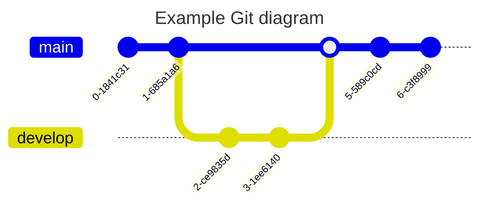

# Hidden Shortcode Palette

## Badges







| Shortcode | Output |
| --        | --     |
| ``     |      |
| `` |  |
| ``  |   |
| ``     |      |
| | |
| ``                    |                     |
| ``                    |                     |
| ``                               |                                |

A badge can be wrapped in markdown link producing following result: [](https://github.com/gohugoio/hugo/releases/tag/v0.147.6)
```tpl
[](https://github.com/gohugoio/hugo/releases/tag/v0.147.6)
```

## Buttons

```tpl
Get Home
Contribute
```

Get Home
Contribute 

## Cards

{}
- 
  ### Line 1
  Line 2
  

- 
  This is tab MacOS content.
  
{}

{}
- 
  **Markdown**  
  Suspendisse sed congue orci, eu congue metus. Nullam feugiat urna massa.
  

- 
  Suspendisse sed congue orci, eu congue metus. Nullam feugiat urna massa, et fringilla metus consectetur molestie.
  

- 
  ### Heading
  This is tab MacOS content.
  
{}

Hugo's built-in figure shortcode is also styled as a card

{}
- ```go-html-template
  
  ```

- 
{}

## Columns

```tpl
{}
- ### Left Content
  Lorem markdownum insigne...

- ### Mid Content
  Lorem markdownum insigne...

- ### Right Content
  Lorem markdownum insigne...
{}
```

{}
- ### Left Content
  Lorem markdownum insigne. Olympo signis Delphis! Retexi Nereius nova develat
  stringit, frustra Saturnius uteroque inter! Oculis non ritibus Telethusa
  protulit, sed sed aere valvis inhaesuro Pallas animam: qui _quid_, ignes.
  Miseratus fonte Ditis conubia.

- ### Mid Content
  Lorem markdownum insigne. Olympo signis Delphis! Retexi Nereius nova develat
  stringit, frustra Saturnius uteroque inter!

- ### Right Content
  Lorem markdownum insigne. Olympo signis Delphis! Retexi Nereius nova develat
  stringit, frustra Saturnius uteroque inter! Oculis non ritibus Telethusa
  protulit, sed sed aere valvis inhaesuro Pallas animam: qui _quid_, ignes.
  Miseratus fonte Ditis conubia.
{}

Settings size ratio for columns

```tpl
{}
- ## x1 Column
  Lorem markdownum insigne...

- ## x2 Column
  Lorem markdownum insigne...
{}
```

{}
- ### x1 Column
  Lorem markdownum insigne. Olympo signis Delphis! Retexi Nereius nova develat
  stringit, frustra Saturnius uteroque inter! Oculis non ritibus Telethusa
  protulit, sed sed aere valvis inhaesuro Pallas animam: qui _quid_, ignes.
  Miseratus fonte Ditis conubia.

- ### x2 Column
  Lorem markdownum insigne. Olympo signis Delphis! Retexi Nereius nova develat
  stringit, frustra Saturnius uteroque inter!
  
  Lorem markdownum insigne. Olympo signis Delphis! Retexi Nereius nova develat
  stringit, frustra Saturnius uteroque inter! Oculis non ritibus Telethusa
  protulit, sed sed aere valvis inhaesuro Pallas animam: qui _quid_, ignes.
  Miseratus fonte Ditis conubia.
{}

## Details

```tpl
{}
Markdown content
Lorem markdownum insigne...
{}
```
```tpl
{}
Markdown content
Lorem markdownum insigne...
{}
```

{}
Markdown content
Lorem markdownum insigne...
{}

## Hints

```tpl
{}
**Markdown content**  
Lorem markdownum insigne. Olympo signis Delphis! Retexi Nereius nova develat
stringit, frustra Saturnius uteroque inter! Oculis non ritibus Telethusa
{}

> [!NOTE|TIP|IMPORTANT|WARNING|CAUTION]
> **Markdown content**  
> Lorem markdownum insigne. Olympo signis Delphis! Retexi Nereius nova develat
> stringit, frustra Saturnius uteroque inter! Oculis non ritibus Telethusa
```

## Example

{}
**Markdown content**  
Lorem markdownum insigne. Olympo signis Delphis! Retexi Nereius nova develat
stringit, frustra Saturnius uteroque inter! Oculis non ritibus Telethusa
{}

{}
**Markdown content**  
Lorem markdownum insigne. Olympo signis Delphis! Retexi Nereius nova develat
stringit, frustra Saturnius uteroque inter! Oculis non ritibus Telethusa
{}

{}
**Markdown content**  
Lorem markdownum insigne. Olympo signis Delphis! Retexi Nereius nova develat
stringit, frustra Saturnius uteroque inter! Oculis non ritibus Telethusa
{}

{}
**Markdown content**  
Lorem markdownum insigne. Olympo signis Delphis! Retexi Nereius nova develat
stringit, frustra Saturnius uteroque inter! Oculis non ritibus Telethusa
{}

{}
**Markdown content**  
Lorem markdownum insigne. Olympo signis Delphis! Retexi Nereius nova develat
stringit, frustra Saturnius uteroque inter! Oculis non ritibus Telethusa
{}

Support for markdown alerts

> [!NOTE]
> **Note**  
> Lorem markdownum insigne. Olympo signis Delphis! Retexi Nereius nova develat
> stringit, frustra Saturnius uteroque inter! Oculis non ritibus Telethusa

> [!TIP]
> **Tip**  
> Lorem markdownum insigne. Olympo signis Delphis! Retexi Nereius nova develat
> stringit, frustra Saturnius uteroque inter! Oculis non ritibus Telethusa

> [!IMPORTANT]
> **Important**  
> Lorem markdownum insigne. Olympo signis Delphis! Retexi Nereius nova develat
> stringit, frustra Saturnius uteroque inter! Oculis non ritibus Telethusa

> [!WARNING]
> **Warning**  
> Lorem markdownum insigne. Olympo signis Delphis! Retexi Nereius nova develat
> stringit, frustra Saturnius uteroque inter! Oculis non ritibus Telethusa

> [!CAUTION]
> **Caution**  
> Lorem markdownum insigne. Olympo signis Delphis! Retexi Nereius nova develat
> stringit, frustra Saturnius uteroque inter! Oculis non ritibus Telethusa

## images

```go-html-template

```


Parameters

`src` 
: The link to the image

`class`   
: An optional CSS class name that will be applied to the `img` element

`alt`   
: An optional alternate text for the image

`title`   
: An optional title for the image

`loading`   
: Sets `loading` control for the image: `lazy`, `eager` or `auto`

## KaTeX

KaTeX shortcode let you render math typesetting in markdown document. See [KaTeX](https://katex.org/)

{}
**Override KaTeX initialization config**  
To override the [initialization config](https://katex.org/docs/options.html) for KaTeX,
create a `katex.json` file in your `assets` folder!
{}




Activation
KaTeX is activated on the page by first use of the shortcode or render block. you can force activation with empty `` and use delimiters defined in configuration in `assets/katex.json`.

Rendering as block

{}

```latex

f(x) = \int_{-\infty}^\infty\hat f(\xi)\,e^{2 \pi i \xi x}\,d\xi

```

````latex
```katex
f(x) = \int_{-\infty}^\infty\hat f(\xi)\,e^{2 \pi i \xi x}\,d\xi
```
````

````latex
$$
f(x) = \int_{-\infty}^\infty\hat f(\xi)\,e^{2 \pi i \xi x}\,d\xi
$$
````

<--->


f(x) = \int_{-\infty}^\infty\hat f(\xi)\,e^{2 \pi i \xi x}\,d\xi


---

```katex
f(x) = \int_{-\infty}^\infty\hat f(\xi)\,e^{2 \pi i \xi x}\,d\xi
```

---

$$
f(x) = \int_{-\infty}^\infty\hat f(\xi)\,e^{2 \pi i \xi x}\,d\xi
$$

{}

Rendering inline 

When KaTeX is active on the page it is possible to write inline expressions.  

| Code | Output |
| --   | --     |
| `\pi(x)` | \pi(x) |
| `\\( \pi(x) \\)` | \\( \pi(x) \\) |

Configuration

KaTeX configuration could be adjusted by editing `assets/katex.json` file. For example to enabled inline delimiters `$..$` put content below into the file.

```json
{
  "delimiters": [
    {"left": "$$", "right": "$$", "display": true},
    {"left": "$", "right": "$", "display": false},
    {"left": "\\(", "right": "\\)", "display": false},
    {"left": "\\[", "right": "\\]", "display": true}
  ]
}
```

## Mermaid

[MermaidJS](https://mermaid-js.github.io/) is library for generating svg charts and diagrams from text.

{}
**Override Mermaid initialization config**  
To override the [initialization config](https://mermaid-js.github.io/mermaid/#/Setup) for Mermaid,
create a `mermaid.json` file in your `assets` folder!
{}

Example

{}

````tpl

````

<--->


{}

{}

```tpl

stateDiagram-v2
    State1: The state with a note
    note right of State1
        Important information! You can write
        notes.
    end note
    State1 --> State2
    note left of State2 : This is the note to the left.

```

<--->


stateDiagram-v2
    State1: The state with a note
    note right of State1
        Important information! You can write
        notes.
    end note
    State1 --> State2
    note left of State2 : This is the note to the left.


{}

Diagrams

Explore more diagrams and syntax on Mermaid [documentation page](https://mermaid.js.org/syntax/flowchart.html).

{}


<--->




{}

## Steps

```tpl
{}
1. ## Suspendisse sed congue orci.
   ...

2. ## Maecenas scelerisque sem.
   ...

3. ## Etiam risus purus.
   ...

4. ## Curabitur sed lacinia velit.
   ...
{}
```

{}
1. ## Suspendisse sed congue orci.
   Suspendisse sed congue orci, eu congue metus. Nullam feugiat urna massa, et fringilla metus consectetur molestie. Curabitur pellentesque sodales ipsum, sed efficitur libero euismod ac. Donec sit amet erat nunc. Suspendisse porta nisl velit, quis auctor massa commodo nec. Donec sollicitudin tellus sit amet massa condimentum luctus. Etiam molestie at ante et convallis.

2. ## Maecenas scelerisque sem.
   Maecenas scelerisque sem a tellus dignissim, in sodales neque varius. Integer quis ex quis sem posuere consequat. Morbi interdum ex et mollis maximus. Proin sed quam nisl. Donec tempus non risus vel auctor. Ut ultricies vitae urna in laoreet. Phasellus cursus nunc sit amet sodales euismod. Suspendisse potenti.

3. ## Etiam risus purus.
   Etiam risus purus, suscipit a orci quis, mollis mollis ante. Vestibulum congue nisl malesuada tortor egestas, a lobortis tellus dictum. Nam nec ultrices justo. Donec malesuada dignissim posuere. 

4. ## Curabitur sed lacinia velit.
   Curabitur sed lacinia velit. Nullam sed ante non quam lobortis hendrerit. Phasellus elementum, erat sit amet imperdiet pulvinar, odio massa lobortis ipsum, in tincidunt metus dolor vel ligula.

{}

## Tabs

```tpl

{} # MacOS Content {}
{} # Linux Content {}
{} # Windows Content {}

```



{}
# MacOS

This is tab **MacOS** content.

Lorem markdownum insigne. Olympo signis Delphis! Retexi Nereius nova develat
stringit, frustra Saturnius uteroque inter! Oculis non ritibus Telethusa
protulit, sed sed aere valvis inhaesuro Pallas animam: qui _quid_, ignes.
Miseratus fonte Ditis conubia.
{}

{}
# Linux

This is tab **Linux** content.

Lorem markdownum insigne. Olympo signis Delphis! Retexi Nereius nova develat
stringit, frustra Saturnius uteroque inter! Oculis non ritibus Telethusa
protulit, sed sed aere valvis inhaesuro Pallas animam: qui _quid_, ignes.
Miseratus fonte Ditis conubia.
{}

{}
# Windows

This is tab **Windows** content.

Lorem markdownum insigne. Olympo signis Delphis! Retexi Nereius nova develat
stringit, frustra Saturnius uteroque inter! Oculis non ritibus Telethusa
protulit, sed sed aere valvis inhaesuro Pallas animam: qui _quid_, ignes.
Miseratus fonte Ditis conubia.
{}




